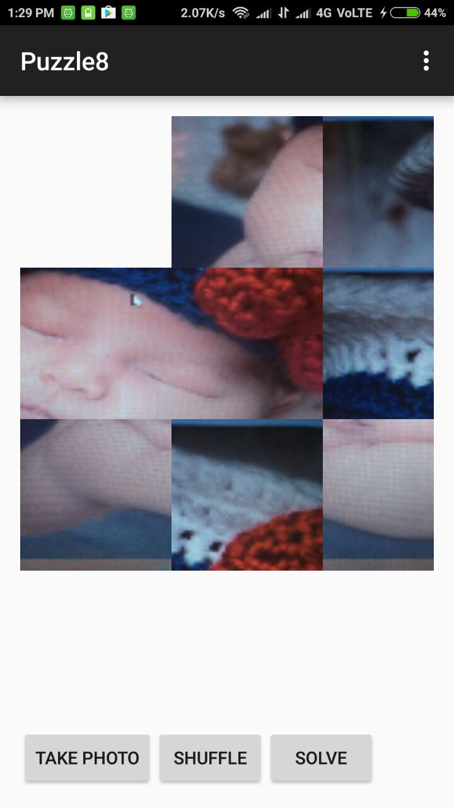

# PuzzleGame
It is Android app game where user can click a real time image and shuffle it. After shuffling it you have to solve the image in grid 3 * 3 . If user is unable to solve and got stuck in between then user can click the solve button and it will reform the image step by step .

|  |   |
|-------------------------------------------|--------------------------------------------|
